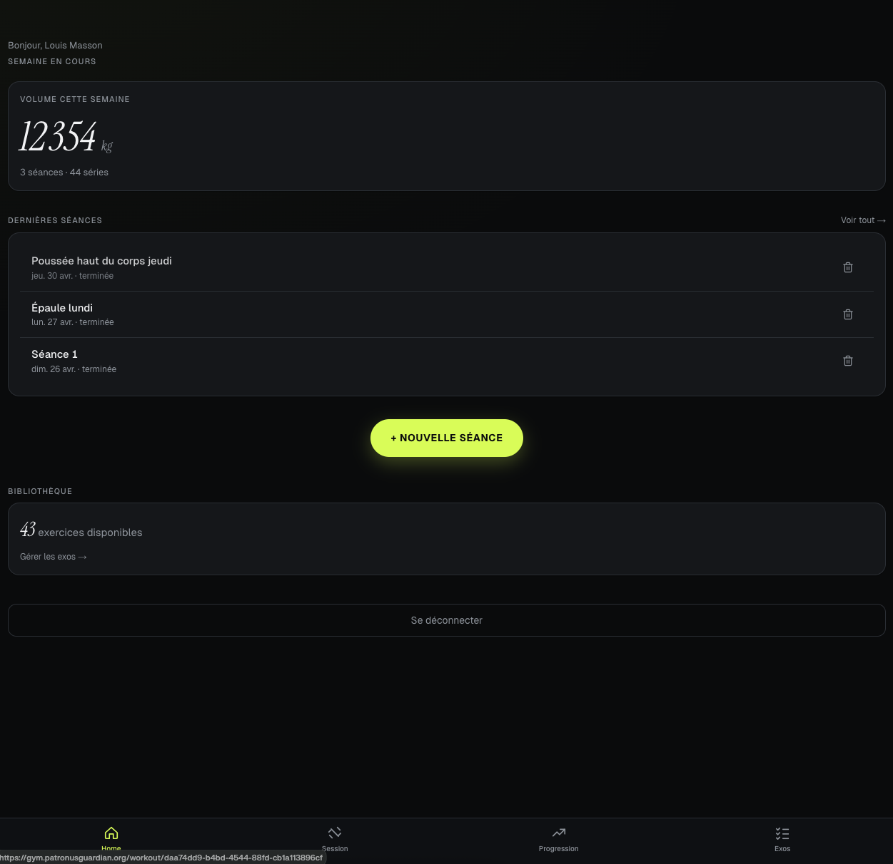

# Gym Logger



🔗 **Démo** : [gym.patronusguardian.org](https://gym.patronusguardian.org/)

**Logge ta perf. Rien d'autre.**

Application web progressive (PWA) pour tracker ses sessions de musculation — conçue pour un usage solo, rapide à l'usage, avec un design qui ne ressemble pas aux apps de sport habituelles.

---

## Aperçu

L'idée de départ : une app minimaliste que j'utilise moi-même à la salle, optimisée pour être rapide à ouvrir sur mobile et logger une série en 3 taps. Pas d'abonnement, pas de réseau social, pas de gamification — juste les données utiles.

**Fonctionnalités :**
- Démarrer une séance et logger des séries (exercice + charge + répétitions + RPE)
- Bibliothèque d'exercices groupée par muscle, personnalisable (rename, favoris, archivage)
- Dashboard progression : volume sur 90 jours, records personnels par exercice
- Duplicate de séance, édition post-séance, rest timer automatique
- Pipeline data vers Grafana (dbt) pour suivi long terme

---

## Design system — Athletic Minimalism

Fond noir · accent lime `#D4FF3D` · typographie éditoriale

| Rôle | Police |
|---|---|
| Titres display | Instrument Serif Italic |
| Interface | Geist Sans |
| Timer / chiffres | Geist Mono |

Le parti-pris : une seule couleur d'accent très saturée sur fond sombre, typographie serif italique pour les titres, chiffres en monospace pour les données de perf. L'UI s'efface pour laisser les chiffres au premier plan.

---

## Stack

| Couche | Techno |
|---|---|
| Framework | Next.js 15 App Router + React 19 + TypeScript |
| Auth & base de données | Supabase (PostgreSQL + RLS) |
| OAuth | Google |
| Style | Tailwind CSS + CSS variables (design tokens) |
| Runtime | Bun 1.3 |
| Deploy | Docker + Traefik + Let's Encrypt |
| Data pipeline | dbt + Grafana |

---

## Schéma de base de données

```
gym.profiles     — extension de auth.users (display_name)
gym.exercises    — catalogue d'exercices par user (29 pré-chargés à l'inscription)
gym.workouts     — séances (date, durée, statut)
gym.sets         — 1 ligne = 1 série (exercise_id, reps, weight_kg, rpe)
```

RLS activé sur toutes les tables : chaque utilisateur ne peut accéder qu'à ses propres données via `auth.uid() = user_id`.

---

## Architecture

```
app/
├── page.tsx                    # Home — volume semaine, dernières séances
├── login/page.tsx              # Auth Google
├── exercises/page.tsx          # Bibliothèque d'exercices
├── progress/page.tsx           # Volume 90j + records personnels
└── session/
    ├── new/page.tsx            # Démarrer une séance
    └── [id]/
        ├── page.tsx            # Loader server
        └── session-editor.tsx  # Client — stepper + optimistic UI

lib/supabase/
├── server.ts                   # Client SSR (cookies)
├── client.ts                   # Client browser
└── middleware.ts               # Refresh session + redirect

middleware.ts                   # Edge — auth guard + injection headers user
```

**Optimisations perf :**
- Auth dédupliquée via header injection (évite un round-trip Supabase par requête)
- Cache exercices par user avec `revalidateTag`
- Edge runtime sur le middleware
- Docker healthcheck qui sert de warmup JIT
- Résultat : −29% TTFB sur Home, −36% mémoire RSS (130 MB → 83 MB)

---

## Pipeline data → Grafana

```
gym.workouts / gym.sets  (OLTP Supabase)
        │
        ├─► clean.gym_sessions   — 1 row par séance (volume, durée, RPE moyen)
        ├─► clean.gym_weekly     — 1 row par semaine (volume total, nb séances)
        └─► clean.gym_prs        — 1 row par exercice (record charge + date)
                │
                └─► Grafana — row 💪 Strength Training
                        ├─ Stats: volume semaine, séances, RPE
                        ├─ Bar chart: volume hebdomadaire
                        └─ Table: top 10 records personnels
```

Refresh quotidien via cron dbt. Les modèles sont dans `data-platform/dbt/models/`.

---

## Lancer en local

**Prérequis :** Bun, un projet Supabase avec le schéma `gym` configuré.

```bash
bun install
cp .env.local.example .env.local   # renseigner URL et anon key Supabase
bun run dev
```

### Exposer le schéma `gym` via PostgREST

Par défaut Supabase n'expose que `public`. À faire une fois dans le SQL Editor :

```sql
alter role authenticator set pgrst.db_schemas to 'public, graphql_public, gym';
notify pgrst, 'reload config';
```

---

## Déploiement Docker

```bash
docker compose up -d --build
```

Le `docker-compose.yml` utilise Traefik pour le routing et Let's Encrypt pour le SSL. Définir `APP_DOMAIN` dans les variables d'environnement du serveur.

---

## Variables d'environnement

```
NEXT_PUBLIC_SUPABASE_URL      URL du projet Supabase
NEXT_PUBLIC_SUPABASE_ANON_KEY Clé anon (publique par design, protégée par RLS)
APP_DOMAIN                    Domaine de déploiement (ex: gym.example.com)
```

---

## Roadmap

- [x] Design system + mockups HTML statiques
- [x] Auth Google end-to-end
- [x] Logger une séance — stepper kg / reps / RPE, optimistic UI
- [x] CRUD exercices — rename inline, favoris, archivage, filtre par muscle
- [x] Vue détail séance, suppression, duplication
- [x] Optimisations perf (auth dedup, cache, edge middleware, Docker warmup)
- [x] Pipeline data dbt → Grafana
- [x] Icône PWA + splash screens iOS
- [x] Quick-add série, rest timer auto, édition séance passée
- [ ] Visualisations motivation : courbes volume, heatmap, détection PR automatique
- [ ] OAuth Apple

---

## Licence

MIT — voir [LICENSE](./LICENSE)
